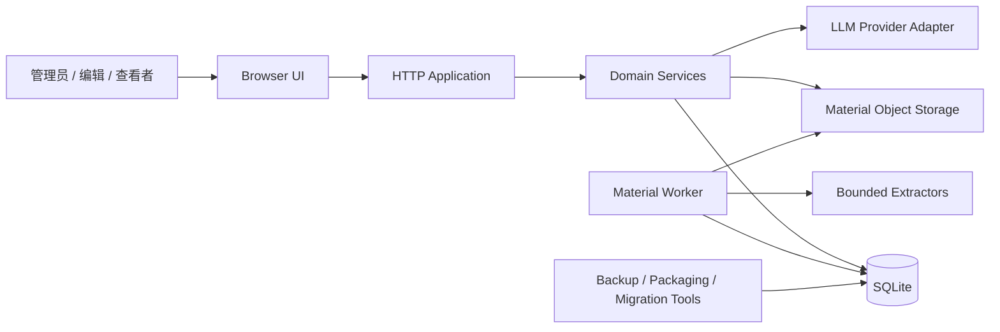
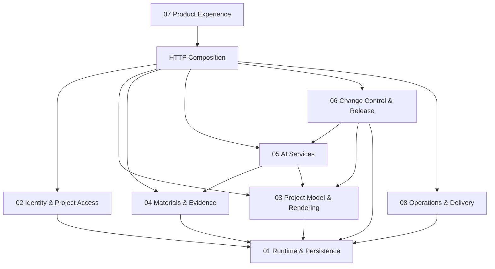

# 系统架构

状态：`canonical`

## 1. Architecture Style

系统采用单进程模块化单体：

- Node.js HTTP 服务。
- 同进程串行材料 worker。
- SQLite 作为唯一事务数据库。
- 本地对象目录保存材料原件和处理产物。
- 浏览器使用仓库内固定 HTML/CSS/JavaScript renderer。
- 外部 LLM 只通过受控 Provider adapter 接入。

模块化边界由目录、服务 API、仓储和数据不变式维护，不依赖网络微服务。

## 2. System Context

## 3. Module Dependency Direction

依赖规则：

- UI 只依赖 HTTP DTO 和 capability，不直接解释数据库角色。
- AI 可以读取发布态和证据，但不能依赖审核或发布写接口。
- Change Control 可以调用版本、验证和提案模块；AI 不能反向调用 Change Control。
- Runtime/Persistence 不依赖产品 UI 或 LLM。
- Operations 可以观察和备份其他模块，但不能绕过其写入不变式。

## 4. Runtime Composition

`server.mjs` 启动顺序：

1. 打开 SQLite。
2. 应用顺序迁移。
3. 可选导入脱敏 fixture。
4. 确保 bootstrap 平台管理员。
5. 从数据库设置和环境构建 Provider 配置。
6. 启动材料处理 worker。
7. 创建 HTTP app 并监听。
8. SIGINT/SIGTERM 时先停 worker，再关闭数据库。

启动失败必须关闭数据库并让进程失败，不以部分初始化状态继续服务。

## 5. HTTP Composition

`src/http/app.mjs` 是 transport/composition layer：

- 解析 JSON、multipart、路径和 Cookie。
- 建立 requestId/trace。
- 解析 principal 和 CSRF。
- 调用 service/module API。
- 映射安全错误响应。
- 提供静态 SPA 和安全响应头。

HTTP 层不得实现项目图、材料、AI 或发布领域规则；这些规则属于对应 service/validator。

## 6. Data Architecture

### Identity and Platform

`users / sessions / projects / project_members / recent_project_access / platform_settings / audit_events`

### Versioned Project Graph

`project_versions / project_modules / project_units / project_stages / project_closures / project_tasks / task_links / project_workstreams / project_cards / project_card_links / project_risks / project_metrics`

### Materials and Evidence

`project_materials / material_artifacts / material_jobs / evidence_blocks / evidence_fts / material_*_grants / material_update_selections / material_readiness_snapshots`

### AI and Proposals

`ai_usage_events / generation_jobs / generation_job_materials / generation_job_evidence / generation_attempts / change_proposals / change_proposal_items / change_proposal_evidence`

### Review and Release

`proposal_review_items / proposal_merges / publication_events`

### Operations

`operation_traces / error_events / product_test_runs / product_test_case_results`

所有跨项目实体必须直接含 `project_id` 或通过带 project/version 复合约束的父实体归属项目。

## 7. Main Data Flows

### 7.1 Read Published Project

`Session → Project authorization → published_version_id → module loader → fixed DTO → fixed browser renderer`

查看者不能通过查询参数切换到 draft 或 proposal。

### 7.2 Material to Evidence

`Upload → gate/policy → project storage → queued job → worker lease → extractor → evidence blocks → FTS/current generation → readiness`

失败不产生“ready”材料，也不让旧 extraction generation 被误当当前版本。

### 7.3 Evidence to Proposal

`Generation request → capability/quota → lock published base + materials + evidence + readiness → provider → schema/field/domain validation → pending proposal`

只有完整验证成功才在一个事务中保存 proposal 和 item/evidence 关系。

### 7.4 Proposal to Published

`Review decisions → copy current draft → apply accepted changes → full graph validation → switch draft pointer → release preview → human publish → new published + new draft baseline`

每个箭头都是独立可审计状态，不允许客户端直接跳跃。

### 7.5 Project Chat

`Question → project authorization → published facts + authorized evidence retrieval → provider → allowlist citation validation → answer`

无证据时返回不足回答；问答没有项目写路径。

## 8. Version Model

- `projects.published_version_id` 指向当前不可变发布版本。
- `projects.draft_version_id` 指向当前可替换草稿版本。
- proposal 锁定 `base_version_id`，必须等于创建时当前发布版本。
- 合并使用 copy-on-write 新草稿，不原地改当前草稿。
- 发布复制草稿为新发布版本，并建立同内容新草稿基线。
- 回滚创建新的发布事件，不覆盖历史版本。

## 9. Capability Model

授权由服务端根据 platform admin 和 project member role 计算，DTO 返回能力：

- read
- edit/upload/generate
- review
- merge
- publish/rollback
- manage members
- operate/diagnose

前端只据 capability 显示操作；服务端仍对每个请求重新授权。

## 10. Failure Semantics

- 输入错误：4xx，返回稳定 code 和用户可行动消息。
- 越权/跨项目：统一 404，避免枚举。
- 冲突/stale：409，不自动覆盖新版本。
- 模型或材料依赖失败：任务进入可重试或终态，不影响浏览。
- 未知异常：500 + requestId，保存脱敏 error event。
- 合并失败：不切换 draft 指针。
- 发布失败：published 指针不变；已成功草稿合并可以恢复继续。

## 11. Security Boundaries

- Cookie 不进入 JavaScript；CSRF 只保存在页面内存。
- 密钥不返回浏览器，不记录日志。
- 材料路径由服务端生成，不接受任意本地路径。
- 压缩文件防 traversal/bomb；提取子进程有超时、大小和输出上限。
- 模型没有工具调用、文件系统、数据库或网络代理权限。
- 固定 renderer 拒绝项目提供的 executable assets。

## 12. Current and Planned

### Implemented

- Phase 1–10 的数据、API、AI、审核发布、运维和 UI 能力。
- 迁移 001–010。
- 160 项后台测试与 44 项 Playwright 基线。

### Planned

- Phase 11 工作流优先 UI 重构。
- 可能增加只读 attention projection 和脱敏 Provider connection test。

任何计划能力在实现和验证前不得写入 `docs/RESULT.md`。
