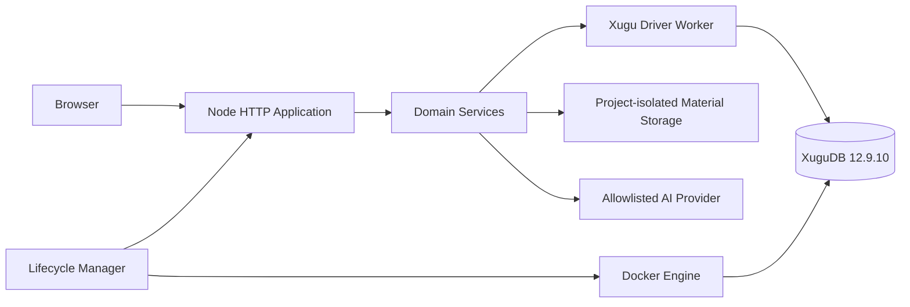
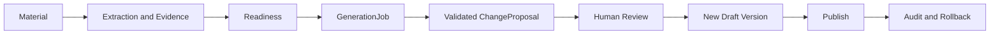

# 系统架构

状态：`canonical`
版本：`1.0.0`

## 1. 运行拓扑

平台是单进程模块化单体。HTTP、领域服务和材料 worker 共享同一数据库接口；虚谷原生驱动独占一个 Worker 线程，业务主线程通过同步桥接保持现有事务契约。

## 2. 启停

managed 模式：

1. 校验 Docker、镜像 manifest 与 SHA-256。
2. 按需 `docker load` 内置 ARM64 镜像。
3. 创建或启动专用容器与 volume。
4. 应用重试连接，执行 8 个有序迁移。
5. 迁移、管理员初始化和 worker 启动后 `/health` 才就绪。
6. 停止时先关闭 HTTP、材料 worker 和数据库连接，再停止专用容器。

external 模式只连接外部虚谷，不管理其生命周期。

## 3. 持久化

- 唯一迁移目录：`src/db/xugu-migrations/`。
- 唯一项目图：`project_cards`、`project_card_links`。
- 数据库适配入口：`src/db/database.mjs`。
- Worker 桥接：`src/db/xugu-database.cjs` 与 `src/db/xugu-worker.cjs`。
- 参数中的空值转换为 SQL `NULL`；CLOB/ArrayBuffer 按 UTF-8 解码。
- 数值列别名不得与同一查询中的字符串 `id` 列重名，避免驱动按错误列描述解码。
- `withTransaction` 提供显式 begin/commit/rollback，不允许事务中重连。

## 4. 项目图与版本

每个版本由统一卡片和关系组成。导入、导出、clone、draft 合并、published facts 与所有 renderer 只消费这套模型。公共字段放表列，类型特有字段放 `card_attrs`；关系全部显式存储并做同版本校验。

## 5. 材料到发布

生成任务锁定上下文摘要。Provider 输出经过 envelope、Schema、字段白名单、证据、日期、关系和图循环校验。任何校验失败都不会写入提案或版本图。

## 6. 信任边界

- 浏览器：不可信输入，受会话、CSRF、权限和大小限制。
- 材料：不可信内容，只能作为证据文本进入受限 prompt。
- Provider：不可信外部系统，无工具权限，只返回 JSON。
- Docker：仅通过参数数组调用，容器、volume 和镜像名经过白名单校验。
- 配置：环境变量优先于本地文件；密钥永不回显完整值。

## 7. 恢复

数据库备份必须在容器停止时执行，将专用 volume 归档为 gzip tar，随后用同一虚谷镜像检查目录并计算 SHA-256。恢复同样要求停止容器，先备份当前 volume，再清空并展开源归档。

## 8. 支持矩阵

| 目标 | 状态 |
|---|---|
| Linux ARM64 portable | 构建、完整栈 smoke |
| macOS Apple Silicon portable | 本地组装与驱动支持 |
| 外部虚谷连接 | 支持，显式 external 模式 |
| Windows、x86、RPM | 不在 v1.0 支持边界 |
